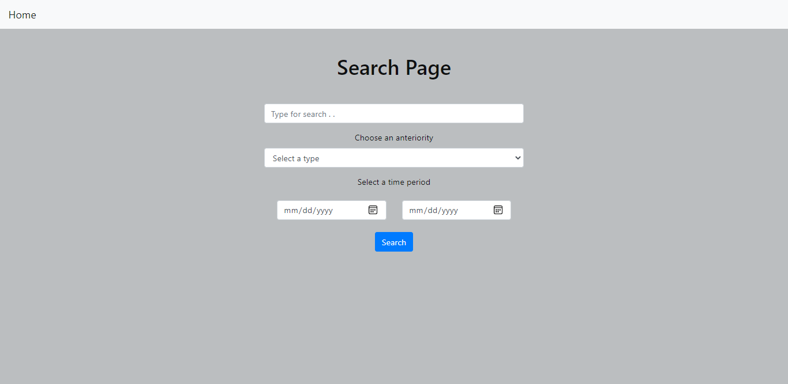
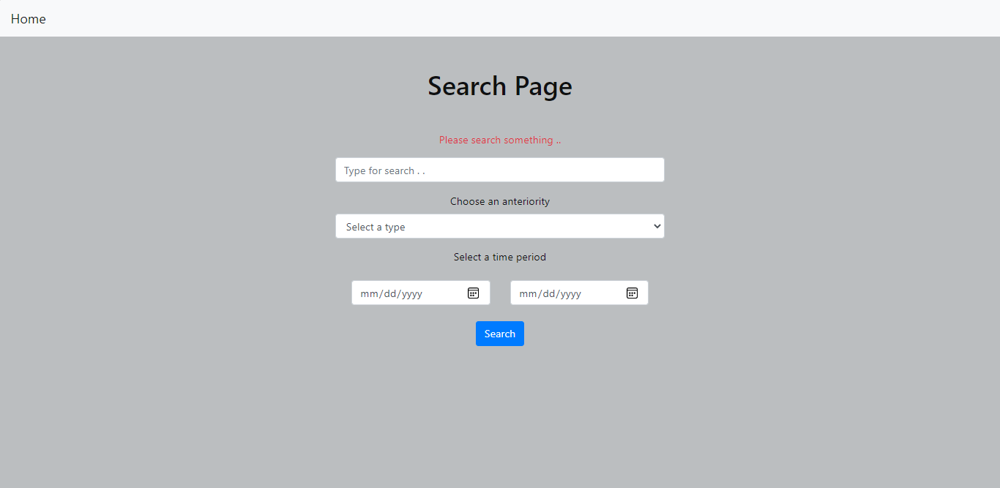
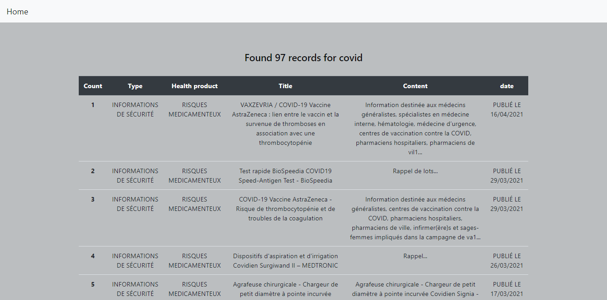

# ansm-crawling

crawl data with the searched key from ANSM database.

## Demo

`Search Page`

`Wrong search message  without search string`

`Displaying Results`

### Stacks

* Python
* Flask 
* Selenium
* Bootstrap 

### To run the proejct (on windows)

* Clone the project
* Run command `python -m virtualenv project_env`
* run command `project_env\Scripts\activate`
* run command `pip install flask selenium`
* After all, run the main.py file 
